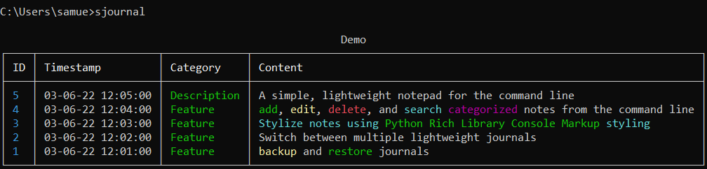
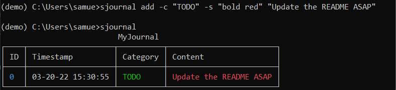

# sjournal 


A simple and light-weight notepad for the command line:



## Installation
### Latest release via pip
```bash
> pip install sjournal
```

## Usage
Sjournal commands can be invoked using either `sjournal` or `sj`
### Creating and Loading Journals
If using Sjournal for the first time, a blank journal called "notes" will be automatically created:
```bash
> sjournal

No config file found. Creating new one at <HOME_DIR>/sjournal/sjournal_config.json

                 notes
┌────┬───────────┬──────────┬─────────┐
│ ID │ Timestamp │ Category │ Content │
├────┼───────────┼──────────┼─────────┤
└────┴───────────┴──────────┴─────────┘
```

To create a new Journal or load an Existing one, use `sjournal load`:
```bash
> sjournal load MyJournal
Set journal to <HOME_DIR>/sjournal/journals/MyJournal.db

> sjournal

               MyJournal
┌────┬───────────┬──────────┬─────────┐
│ ID │ Timestamp │ Category │ Content │
├────┼───────────┼──────────┼─────────┤
└────┴───────────┴──────────┴─────────┘
```

### Adding Notes
Add notes with `sjournal add`:

- Set the category with `-c/--category`. Default category is "General"
- Set the Style ([Rich Markup](https://rich.readthedocs.io/en/latest/markup.html)) with `-s/--style`

```bash
> sjournal add -c TODO -s "bold red" "Update the README ASAP"
~ OR ~
> sjournal add --category="TODO" --style="bold red" "Update the README ASAP"

> sjournal
```



### Listing and Searching Notes
Show notes with `sjournal` or `sjournal list`:
```bash
Show most recent 5 notes by default:
> sjournal list
                     MyJournal
┌────┬───────────────────┬──────────┬──────────────┐
│ ID │ Timestamp         │ Category │ Content      │
├────┼───────────────────┼──────────┼──────────────┤
│ 5  │ 03-20-22 15:55:40 │ General  │ Misc. Note 5 │
│ 4  │ 03-20-22 15:55:39 │ General  │ Misc. Note 4 │
│ 3  │ 03-20-22 15:55:38 │ General  │ Misc. Note 3 │
│ 2  │ 03-20-22 15:55:37 │ General  │ Misc. Note 2 │
│ 1  │ 03-20-22 15:55:35 │ General  │ Misc. Note 1 │
└────┴───────────────────┴──────────┴──────────────┘

Show all notes:
> sjournal list -a 
                          MyJournal
┌────┬───────────────────┬──────────┬────────────────────────┐
│ ID │ Timestamp         │ Category │ Content                │
├────┼───────────────────┼──────────┼────────────────────────┤
│ 5  │ 03-20-22 15:55:40 │ General  │ Misc. Note 5           │
│ 4  │ 03-20-22 15:55:39 │ General  │ Misc. Note 4           │
│ 3  │ 03-20-22 15:55:38 │ General  │ Misc. Note 3           │
│ 2  │ 03-20-22 15:55:37 │ General  │ Misc. Note 2           │
│ 1  │ 03-20-22 15:55:35 │ General  │ Misc. Note 1           │
│ 0  │ 03-20-22 15:30:55 │ TODO     │ Update the readme ASAP │
└────┴───────────────────┴──────────┴────────────────────────┘

Show the last N notes:
> sjournal list 2
                     MyJournal
┌────┬───────────────────┬──────────┬──────────────┐
│ ID │ Timestamp         │ Category │ Content      │
├────┼───────────────────┼──────────┼──────────────┤
│ 5  │ 03-20-22 15:55:40 │ General  │ Misc. Note 5 │
│ 4  │ 03-20-22 15:55:39 │ General  │ Misc. Note 4 │
└────┴───────────────────┴──────────┴──────────────┘

Show notes with a given category:
> sjournal list -c TODO
                          MyJournal
┌────┬───────────────────┬──────────┬────────────────────────┐
│ ID │ Timestamp         │ Category │ Content                │
├────┼───────────────────┼──────────┼────────────────────────┤
│ 0  │ 03-20-22 15:30:55 │ TODO     │ Update the readme ASAP │
└────┴───────────────────┴──────────┴────────────────────────┘

Search note content with a specific word or phrase (regex allowed)
> sjournal search readme
                          MyJournal
┌────┬───────────────────┬──────────┬────────────────────────┐
│ ID │ Timestamp         │ Category │ Content                │
├────┼───────────────────┼──────────┼────────────────────────┤
│ 0  │ 03-20-22 15:30:55 │ TODO     │ Update the readme ASAP │
└────┴───────────────────┴──────────┴────────────────────────┘
```

### Editing and Deleting Notes
Edit the most recent note, or edit by ID:
```bash
> sjournal edit
Editing Note #0 (copied to clipboard): "Update the README ASAP"
Enter new note text ([bold red]Update the README ASAP[/]): Update the readme eventually

> sjournal edit 0
Editing Note #0 (copied to clipboard): "Update the readme eventually"
Enter new note text (Update the readme eventually): Update the readme [bold red]RIGHT NOW[/]
```
Delete notes by a single ID, mutiple IDs, or a range of IDs:
```bash
> sjournal
                     MyJournal
┌────┬───────────────────┬──────────┬──────────────┐
│ ID │ Timestamp         │ Category │ Content      │
├────┼───────────────────┼──────────┼──────────────┤
│ 5  │ 03-20-22 15:48:38 │ General  │ Misc. Note 5 │
│ 4  │ 03-20-22 15:48:37 │ General  │ Misc. Note 4 │
│ 3  │ 03-20-22 15:48:34 │ General  │ Misc. Note 3 │
│ 2  │ 03-20-22 15:48:33 │ General  │ Misc. Note 2 │
│ 1  │ 03-20-22 15:48:30 │ General  │ Misc. Note 1 │
└────┴───────────────────┴──────────┴──────────────┘

> sjournal delete 4
DELETED NOTE #4

> sjournal delete 1 2 3
DELETED NOTE #1
DELETED NOTE #2
DELETED NOTE #3

> sjournal delete 2-5
DELETED NOTE #2
DELETED NOTE #3
DELETED NOTE #4
DELETED NOTE #5
```

### Backup and Restore Journals
Journals can be backed up and restored with `sjournal backup` and `sjournal restore`

Specific filenames can be given with `-f <filename>`. Othewise, the current time at backup will be used.
```bash
> sjournal backup
BACKING UP C:/Users/samue/sjournal/journals/MyJournal.db 
TO FILE C:/Users/samue/sjournal/journals/backups/MyJournal/backup_MyJournal_22_03_20_16_00_45.db

> sjournal restore
RESTORING BACKUP FROM C:\Users\samue\sjournal\journals\backups\MyJournal\backup_MyJournal_22_03_20_16_00_45.db
REPLACING C:\Users\samue\sjournal\journals\MyJournal.db
```


## Custom Aliases (Windows)
If you want to run Sjournal with a different shorthand within Cmder or Windows Cmd (such as `myalias`):

### Setting up an alias in [Cmder](https://cmder.net)
```bash
> alias myalias=sjournal $*
```

### Setting up an alias in Windows Cmd
```bash
> cd c:/
> mkdir alias
> cd alias
> echo @echo off >> myalias.bat
> echo echo. >> myalias.bat
> echo sjournal %* >> myalias.bat
```
Finally, add `c:/alias` to PATH in your system environment variables.

After restarting the terminal, sjournal can be used by calling the new alias in the command line:
```bash
> myalias --version
```

## Full List of Commands
To see help for a specific command, use `sjournal [COMMAND] --help`
```
usage: sjournal [-h] [-d] [-v] {add,backup,categories,delete,edit,erase,help,list,load,restore,search} ...

options:
  -h, --help            show this help message and exit
  -d, --debug           Output to reports/debug.log instead of stdout
  -v, --version         Show sjournal information

Commands:
  {add,backup,categories,delete,edit,erase,help,list,load,restore,search}
                        Commands
    add                 Add a note to the database
    backup              Backup the current journal
    categories          List all categories in the current journal
    delete              Delete one or multiple notes from the database
    edit                Edit a note to the database
    erase               Delete all notes from the current journal
    help                Display help text
    list                List notes in the database
    load                Load a journal or create a new one if it doesn't exist
    restore             Restore the database from a file. If --filename is not given, restore the latest backup
    search              List notes matching search term

To see help for specific commands, use sjournal [COMMAND] --help
```
